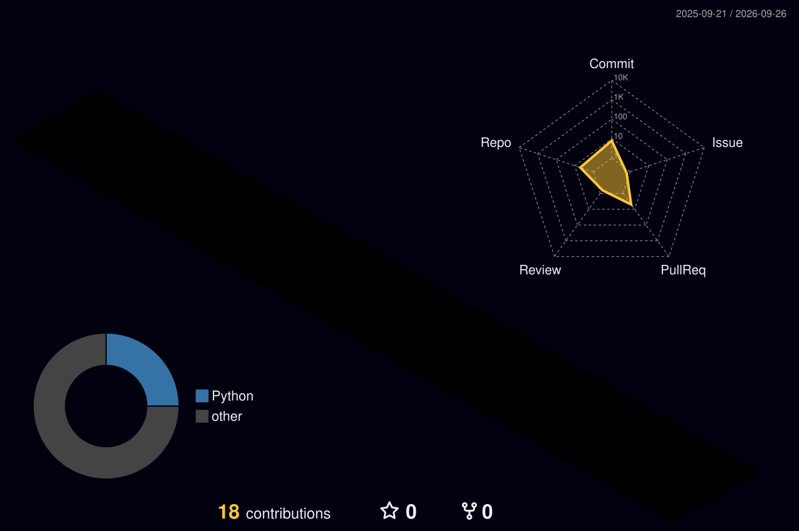

<div align="center">


[](https://git.io/typing-svg)

<p>
  <a href="https://github.com/fullstackchi?tab=followers"></a>
  
  
</p>

</div>

## `> whoami`

```ts
const abdulaziz = {
  role: "backend-first full-stack developer",
  base: "Uzbekistan 🇺🇿",
  builds: ["scalable APIs", "product platforms", "desktop tools", "creative web"],
  currentFocus: ["Node.js", "NestJS", "PostgreSQL", "systems thinking"],
  workstation: ["Windows 11", "WSL · Ubuntu", "Ubuntu VPS"],
  principle: "Make it useful. Make it fast. Then make it feel inevitable.",
};
```

I like the part of engineering where **architecture meets experience**: clean service boundaries, dependable data flows, practical automation, and interfaces with enough personality to be remembered.

- 🧠 Designing backend systems with **TypeScript, NestJS, Prisma, PostgreSQL and JWT**
- 🖥️ Building across **web, desktop and Linux server environments**
- 🧪 Exploring motion, 3D interactions, developer tools and AI-assisted products
- ⚙️ Automating the boring parts with **PowerShell, Bash/Fish, Python and Node.js**
- 🧭 Learning by shipping, measuring, rebuilding and documenting the sharp edges

## `> load_stack --visual`

<div align="center">

[](https://skillicons.dev)

[](https://skillicons.dev)

</div>

<table>
  <tr>
    <td><strong>Backend</strong></td>
    <td>Node.js · NestJS · REST APIs · Auth · Prisma · PostgreSQL</td>
  </tr>
  <tr>
    <td><strong>Frontend</strong></td>
    <td>Vue · React · Vite · Anime.js · interaction-first UI</td>
  </tr>
  <tr>
    <td><strong>Systems</strong></td>
    <td>Windows · WSL · Ubuntu VPS · Docker · networking</td>
  </tr>
  <tr>
    <td><strong>Workflow</strong></td>
    <td>mise · npm/pnpm · PowerShell 7 · Fish · conventional commits</td>
  </tr>
</table>

## `> telemetry --live`

<div align="center">
  
  
</div>

<div align="center">
  
</div>

<div align="center">
  
</div>

## `> render_contributions --mode 3d`

<div align="center">
  
  <sub>Generated from live contribution data and refreshed automatically every day.</sub>
</div>

## `> current_coordinates`

```text
01  Build APIs that stay understandable as the product grows
02  Connect backend, admin, student-facing and desktop experiences
03  Turn repetitive setup and operations into reliable automation
04  Push web motion beyond decoration — make interaction tell the story
05  Keep the toolchain sharp, portable and boring in the best way
```

<details>
<summary><strong>Operator notes</strong></summary>

<br>

- Default branch: `main`
- Commit style: `type: concise lowercase message`
- Runtime manager: `mise`
- Preferred shells: PowerShell 7 and Fish
- Favorite constraint: ship something directly runnable

</details>

## `> connect`

<div align="center">

**Interesting problem? Strange idea? Useful tool that should exist?**

[](https://github.com/fullstackchi)
[](mailto:abdulaziz0207@mail.ru)

<br>

`status: building` &nbsp;•&nbsp; `latency: low` &nbsp;•&nbsp; `curiosity: unbounded`


</div>
